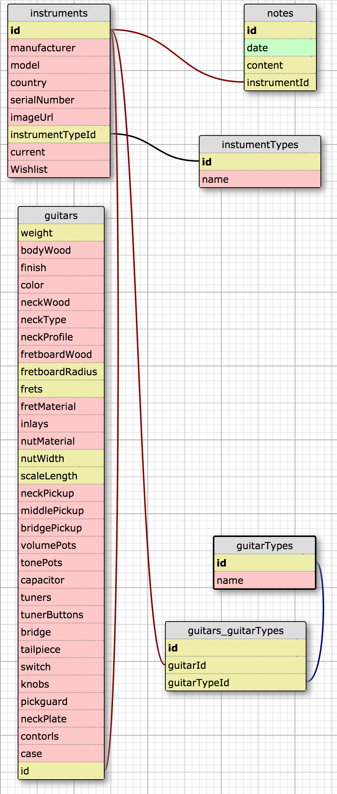

# Equiplist

#### An API that allows users to track a personal collection of musical gear. (_This is an Epicodus exercise that is a work in progress_)

#### By _**Matt Miller**_

## Description

This application will allow users to add and update gear to a personal collection

#### User Story

A. As a user, I want to see recent instruments in the collection (get guitars in collection, get amps in collection, get pedals in collection)<br>
B. As a user, I want to see all guitars in the collection (get guitars in collection)<br>
C. As a user, I want to see all amps in the collection (get amps in collection) <br>
D. As a user, I want to see all pedals in the collection (get pedals in collection) <br>
E. As a user, I want to see specific information about a single guitar (get guitar in collection or wishlist)<br>
F. As a user, I want to see specific information about a single amp (get amp in collection or wishlist)<br>
G. As a user, I want to see specific information about a single pedal (get pedal in collection or wishlist)<br>
H. As a user, I want to be able to add a guitar to the database (post guitar)<br>
I. As a user, I want to be able to add an amp to the database (post amp)<br>
J. As a user, I want to be able to add a pedal to the database (post pedal)<br>
K. As a user, I want to see which guitar type(s) a single guitar is associated with (get guitarTypes by guitar id)<br>
L. As a user, I want to be able to add a guitar type to a guitar (post guitarType by guitar id)<br>
M. As a user, I want to see all guitars of a specific guitar type (get guitars by guitarType id)<br>
N. As a user, I want to be able to add a note on an instrument (post note by instrument id)<br>
O. As a user, I want to see all notes for an instrument (get notes by instrument id)<br>
P. As a user, I want to edit instrument details when they change (Post update guitar, post update amp, post, update pedal)<br>
Q. As a user, I want to delete instruments when they are no longer in my collection or wantlist (post delete guitar, post delete amp, post delete pedal).
R. As a user, I want to delete notes that are no longer relevant (post delete note)<br>
S. As a user, I want to delete a guitar type association in case of error (post delete guitarType)<br>


## Data relationship


## Setup/Installation Requirements

* View program by cloning repository from https://github.com/mattfmiller/equiplist
* Open project in IDE such as IntelliJ IDEA
* Run App.java to compile the program
* Use a program such as postman to create API requests to localhost:4567
  * Get all guitars in collection: `get:` `/guitars`
  * Get all guitars in wishlist: `get:` `/guitars/wishlist`
  * Get specific guitar: `get:` `/guitars/{guitar_id}`
  * Add a guitar: `post:` `/guitars/new`
    * As JSON of the format: <br>
    ```
    {
      "manufacturer": "{user_input}",
      "model": "{user_input}",
      "country": "{user_input}",
      "serialNumber": "{user_input}",
      "description": "{user_input}",
      "year": {user_input},
      "weight": {user_input},
      "imageUrl": "{user_input}",
      "current": {user_input},
      "wishlist": {user_input},
      "paid": {user_input},
      "sold": {user_input},
      "bodyWood": "{user_input}",
      "finish": "{user_input}",
      "color": "{user_input}",
      "binding": "{user_input}",
      "neckWood": "{user_input}",
      "neckType": "{user_input}",
      "neckProfile": "{user_input}",
      "fretboardWood": "{user_input}",
      "fretboardRadius": {user_input},
      "frets": {user_input},
      "fretMaterial": "{user_input}",
      "inlays": "{user_input}",
      "nutMaterial": "{user_input}",
      "nutWidth": {user_input},
      "scaleLength": {user_input},
      "neckPickup": "{user_input}",
      "middlePickup": "{user_input}",
      "bridgePickup": "{user_input}",
      "volumePots": "{user_input}",
      "tonePots": "{user_input}",
      "capacitor": "{user_input}",
      "tuners": "{user_input}",
      "tunerButtons": "{user_input}",
      "bridge": "{user_input}",
      "tailpiece": "{user_input}",
      "guitarSwitch": "{user_input}",
      "knobs": "{user_input}",
      "pickguard": "{user_input}",
      "controls": "{user_input}",
      "guitarCase":"{user_input}"
    }
    ```
    * Get all amps in collection: `get:` `/amps`
    * Get all amps in wishlist: `get:` `/amps/wishlist`
    * Get specific amp: `get:` `/guitars/{amp_id}`
    * Add an amp: `post:` `/amps/new`
      * As JSON of the format: <br>
      ```
      {
        "manufacturer": "{user_input}",
        "model": "{user_input}",
        "country": "{user_input}",
        "serialNumber": "{user_input}",
        "description": "{user_input}",
        "year": {user_input},
        "weight": {user_input},
        "imageUrl": "{user_input}",
        "current": {user_input},
        "wishlist": {user_input},
        "paid": {user_input},
        "sold": {user_input},
        "instrument": "{user_input}",
        "type": "{user_input}",
        "power": {user_input},
        "cabinetWood": "{user_input}",
        "finish": "{user_input}",
        "grillCloth": "{user_input}",
        "width": {user_input},
        "depth": {user_input},
        "height": {user_input},
        "electronics": "{user_input}",
        "speakers": "{user_input}",
        "tubes": "{user_input}",
        "reverb": "{user_input}",
        "tremolo": "{user_input}",
        "externalSpeaker": "{user_input}",
        "handle": "{user_input}",
        "knobs": "{user_input}",
        "jewelLight": "{user_input}",
        "controlPanel": "{user_input}",
        "logo": "{user_input}",
        "tiltLegs": "{user_input}",
        "feet": "{user_input}",
        "controls": "{user_input}",
        "cover": "{user_input}"
      }
      ```
      * Get all pedals in collection: `get:` `/pedals`
      * Get all pedals in wishlist: `get:` `/pedals/wishlist`
      * Get specific pedal: `get:` `/pedals/{pedal_id}`
      * Add a pedal: `post:` `/pedals/new`
        * As JSON of the format: <br>
        ```
        {
          "manufacturer": "{user_input}",
          "model": "{user_input}",
          "country": "{user_input}",
          "serialNumber": "{user_input}",
          "description": "{user_input}",
          "year": {user_input},
          "weight": {user_input},
          "imageUrl": "{user_input}",
          "current": {user_input},
          "wishlist": {user_input},
          "paid": {user_input},
          "sold": {user_input},
          "type": "{user_input}",
          "power": "{user_input}",
          "width": {user_input},
          "depth": {user_input},
          "height": {user_input},
          "electronics": "{user_input}",
          "trueBypass": {user_input},
          "inputImpedance": {user_input},
          "outputImpedance": {user_input},
          "currentDraw": "{user_input}",
          "controls": "{user_input}",
          "features": "{user_input}",
        }
        ```

## Known Bugs

* N/A

## Support and contact details

For support, contact: matt.f.miller@live.com

## Technologies Used

* Java
* Spark
* SQL Database
* H2

### License

This software is licensed under the GPL license.

Copyright © 2018 **Matt Miller**
