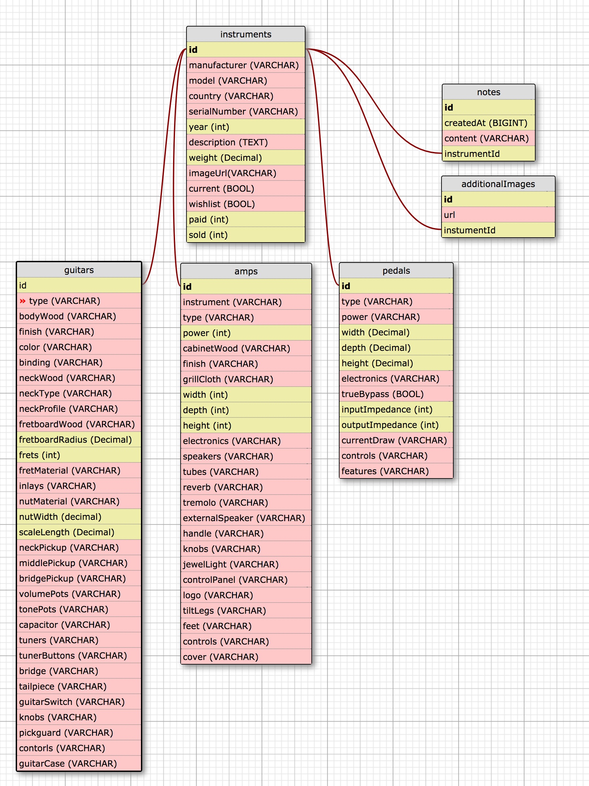

# Equiplist

#### An API that allows users to track a personal collection of musical gear. (_This is an Epicodus exercise that is a work in progress_)

#### By _**Matt Miller**_

## Description

This application will allow users to add and update gear to a personal collection

#### User Story

A. As a user, I want to see all Instruments in the collection
B. As a user, I want to see one individual Instrument
C. As a user, I want to see specific information such as the Instruments's make, model, finish, etc...
D. As a user, I want to see which Instrument Type a single Instrument is associated with
E. As a user, I want to see all Instruments of a specific Instrument Type (i.e. Guitar or Pedal) so I can browse through them
F. As a user, I want to be able to leave a Note on an Instrument  
G. As a user, I want to see all Notes for an Instrument
I. As an admin, I want to be able to add a Restaurant to the database  
J. As an admin, I want to edit Instrument details when they change
L. As an admin, I want to delete Reviews that are no longer relevant
M. As an admin, I want to add an Instrument Type so an Instrument can be associated with it

## Data relationship

## Setup/Installation Requirements

* View program by cloning repository from https://github.com/mattfmiller/jadle
* Open project in IDE such as IntelliJ IDEA
* Run App.java to compile the program
* Use a program such as postman to create API requests to localhost:4567
  * To add

## Known Bugs

* N/A

## Support and contact details

For support, contact: matt.f.miller@live.com

## Technologies Used

* Java
* Spark
* SQL Database
* H2

### License

This software is licensed under the GPL license.

Copyright © 2018 **Matt Miller**
